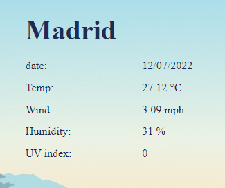
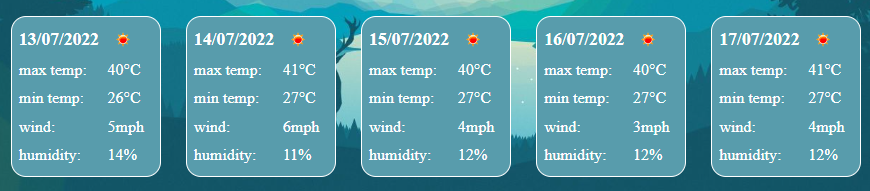

# Weather App

## Project Description
* This weather app tells the user the current weather and the forecast for five days of a city of their selection. It was made using the openweatheramp api to get all the information

* link to the api: https://openweathermap.org/api

* I did my best making this application if there is anyquestions please ask me or if ther is anything you think i can improve please let me know 

* The aplication is not responsive but i will make it in a future commit

## technologies

* html

* css

* javascript

## How to use it
this is the application it is user friendly 

In this part of the weather app the current weather of the choosen city will be displayed

Here the use can submit the city and use the buttons to diplay the weather of cities the user has searched  

And last but not least the forecast for 5 days

## Deployed Application

Link to the deployed project: https://joacogm12.github.io/weather-app/